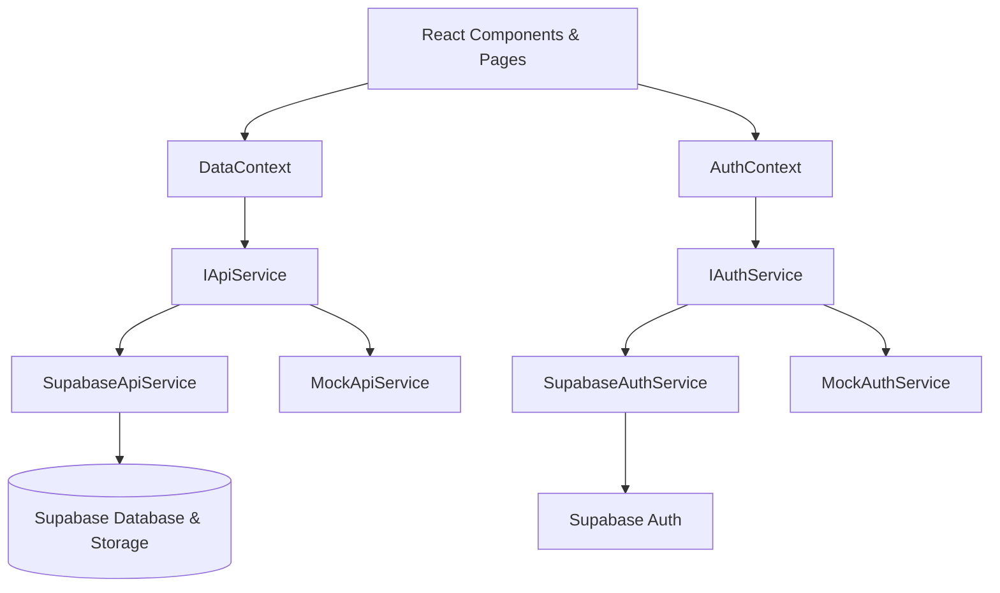
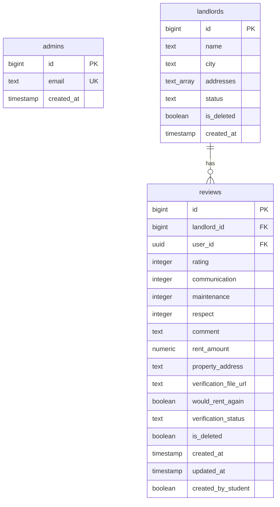

# Rate My Landlord — Architecture & Background

This document provides background details, architectural design patterns, database schema descriptions, and security patterns used in the **Rate My Landlord** platform.

---

## 1. Project Background

**Rate My Landlord** is a community-driven web application built for renters (primarily students at CMU, Pitt, etc.) to review and rate landlords. Key goals of the platform:
* **Transparency:** Share detailed scores on communication, maintenance, and respect.
* **Verification:** Allow students to upload a verification document (PDF) to prove they are students, adding credibility to reviews.
* **Moderation:** Provide a dashboard for administrators to approve new landlord entries and verify student reviews.

---

## 2. Core Architecture

The frontend is built with **React 19**, **TypeScript**, and **Tailwind CSS**. It connects to a **Supabase** backend using a clean, testable Service Pattern.



### Dependency Injection / Service Layer
To make the application testable and allow development without active network resources, all backend calls are routed through interface abstractions (`IApiService` and `IAuthService` defined in `services/interfaces.ts`).
* **Mock Services (`MockApiService`, `MockAuthService`):** Fallback implementations that use in-memory data. If Supabase environment variables are missing (or in testing), the app falls back to mock mode, displaying a yellow warning banner.
* **Supabase Services (`SupabaseApiService`, `SupabaseAuthService`):** Production services querying Supabase DB, Auth, and Storage.

---

## 3. Database Schema Design

The PostgreSQL database (managed via Supabase) contains three primary tables: `admins`, `landlords`, and `reviews`.



### Table Breakdown
1. **`admins`**: Holds email addresses of authorized administrators. Used in the `public.is_admin()` SQL function to restrict access.
2. **`landlords`**: Contains landlord details. New landlords added by users start with `status = 'pending'` and must be approved by an administrator before appearing publicly.
3. **`reviews`**: Reviews posted by users or guests. Contains scoring metrics, rental details, and verification status (`unverified`, `pending`, `verified`).

---

## 4. Row Level Security (RLS) Model

The application protects user data using Row Level Security directly inside PostgreSQL.

### Admin Helper Function
We use a `SECURITY DEFINER` function to check if the current user's email belongs to the `admins` table. Using `SECURITY DEFINER` allows the function to execute queries on the `admins` table regardless of RLS settings on that table.
```sql
CREATE OR REPLACE FUNCTION public.is_admin()
RETURNS boolean SECURITY DEFINER AS $$
BEGIN
  RETURN EXISTS (
    SELECT 1 FROM public.admins
    WHERE email = auth.jwt() ->> 'email'
  );
END;
$$ LANGUAGE plpgsql;
```

### Table Security Policies
* **`admins` Table:**
  * Anyone can read admin emails (`SELECT` policy) to check whether they are logged in as admin on the client side.
* **`landlords` Table:**
  * **Select:** Admins can view all landlords. Anonymous and authenticated users can view only approved landlords (`status = 'approved' AND NOT is_deleted`). Logged-in users can view their own pending landlords.
  * **Insert:** Authenticated users can insert new landlords (always starting as `pending`).
  * **Update:** Only admins can update landlord details or approve/reject them.
* **`reviews` Table:**
  * **Select:** Everyone can view active reviews (`NOT is_deleted`). Admins can view all reviews (including deleted).
  * **Insert:** Anyone can insert reviews (guest users can submit reviews, where `user_id` is `NULL`).
  * **Update:** Only the owner of the review can update it (`auth.uid() = user_id`). Admins can update any review.

### Storage Security Policies
Verification PDFs uploaded by users are saved in a private Supabase Storage bucket named `verification-files`.
* **Insert:** Allowed only for authenticated users. The folder structure is forced to match the user's UUID: `bucket_id = 'verification-files' AND (storage.foldername(name))[1] = auth.uid()::text`.
* **Select & Delete:** Restricted to administrators (`public.is_admin()`). Admins use signed URLs to securely access the PDFs for moderation.

---

## 5. Testing Framework

The repository is equipped with integration-style flow tests powered by **Vitest** and **React Testing Library** in a `jsdom` environment.
* Tests mock the backend service layer entirely (`MockApiService`, `MockAuthService`) and render full routes to verify user behaviors.
* Test files are located under `tests/flows/` and cover all core use cases (searching, registering, writing reviews, admin workflows).
* **Branch-Agnostic Design:** To support running the identical test suite on both the `main` and `ui-changes` branches, tests query elements using custom query helpers (defined in [queryHelpers.ts](file:///Ubuntu/home/sebas/coding/ratemylandlord/tests/utils/queryHelpers.ts)). These helpers look for semantic HTML structures (e.g. `input[type="email"]`, `input[type="password"]`), ARIA roles, data-testids, and collections of flexible regex patterns rather than static text strings.

